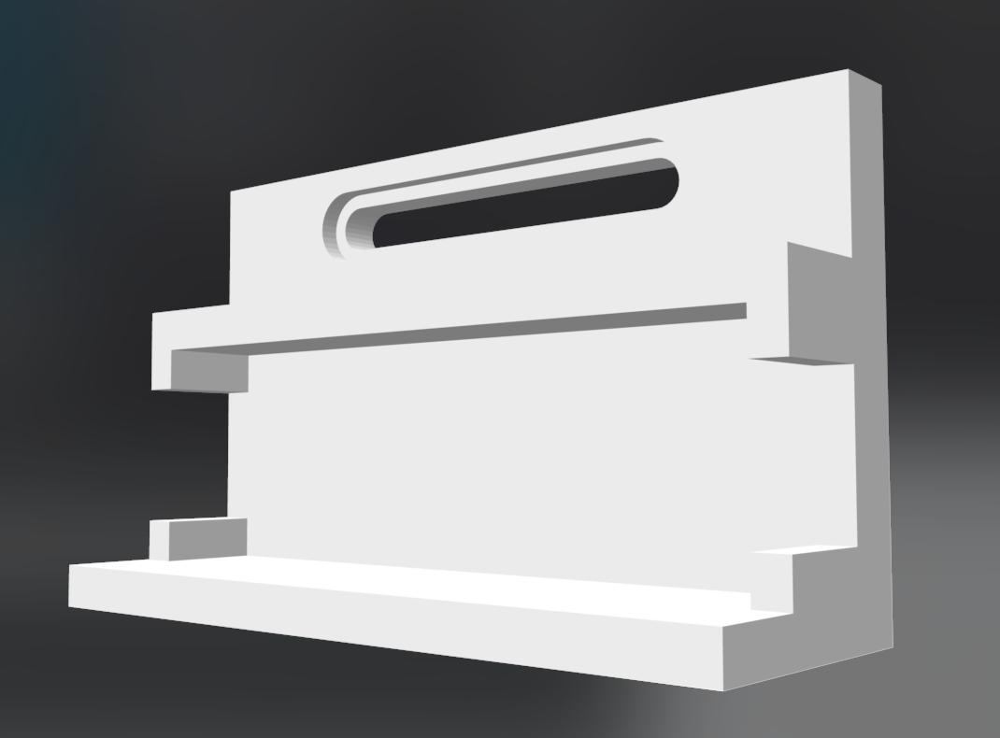
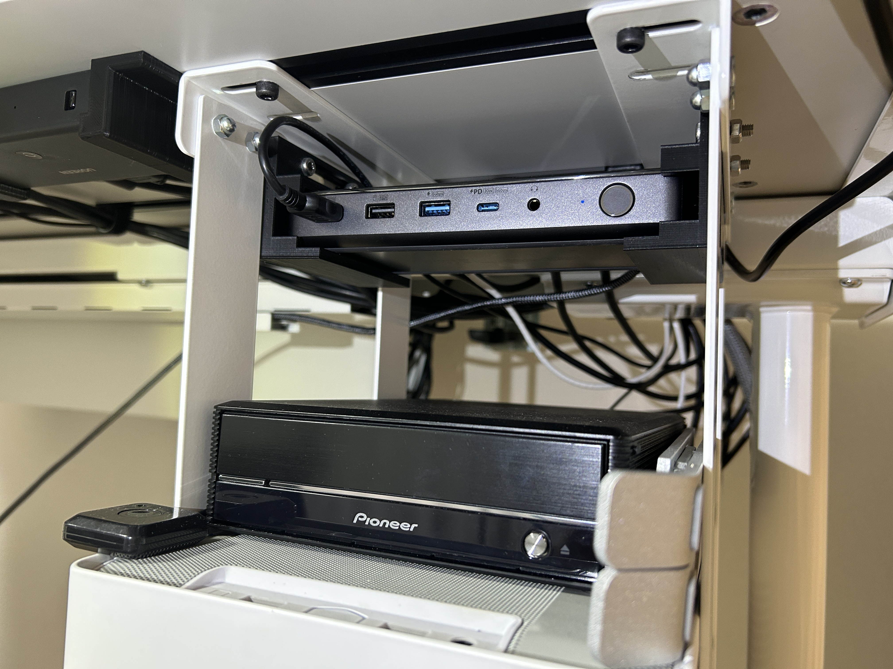
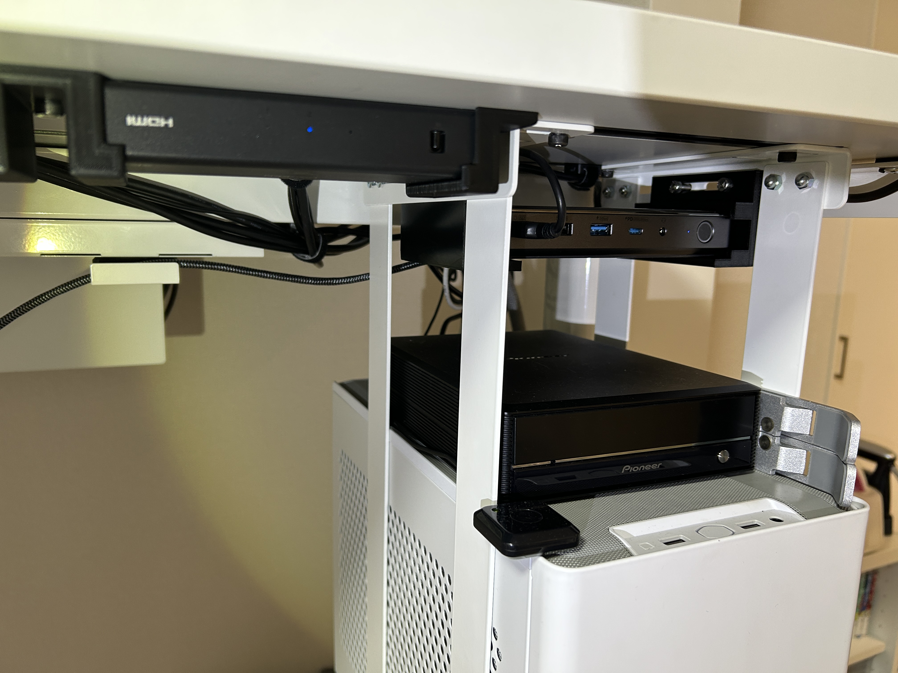

# Anker 564 mount

## About Anker 564

[Anker 564](https://www.ankerjapan.com/products/a83a5)はDisplayLink対応のDockです。

## image

## 使用方法
今回は、Bracket SにM5x15mmの六角穴付きボルトとナットで2点固定して使用しています。
Bracketの間隔は170~180mmを想定しています。
