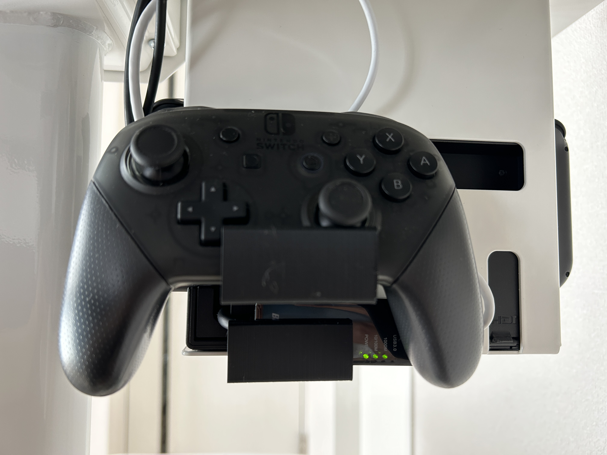
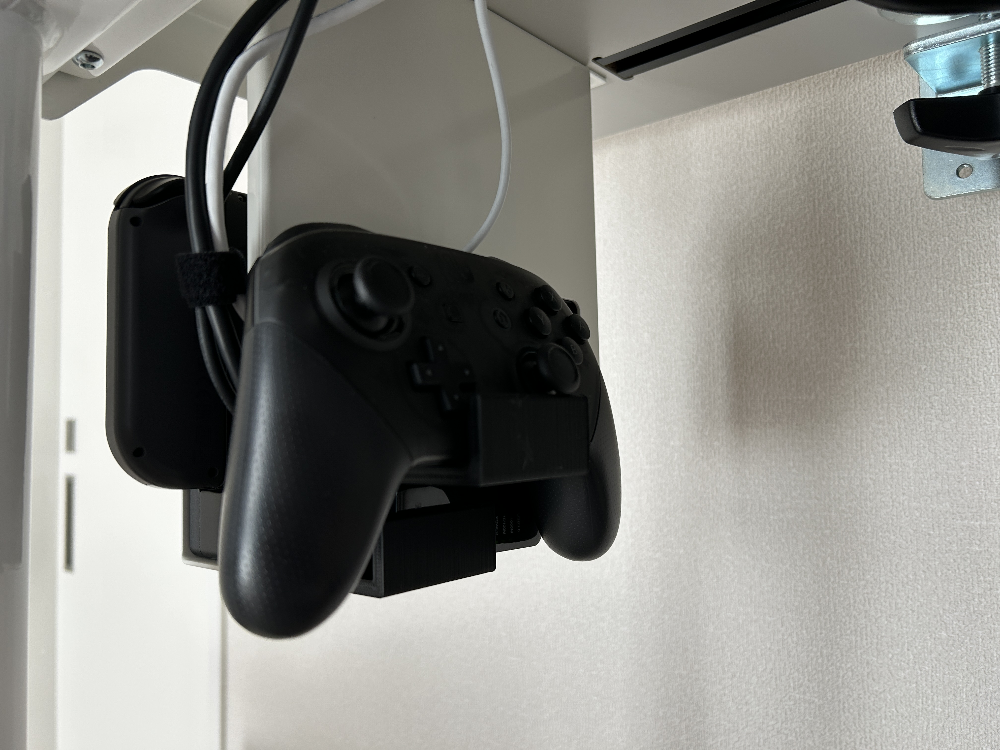
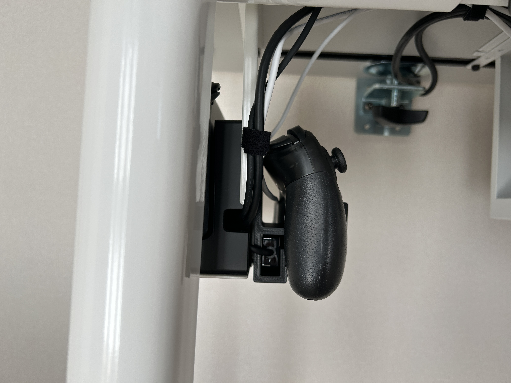

# ProCon Holder

## About ProCon Holder

Nintendo Switchのスタンドの背面にPro-Conと、BUFFALO製有線LANアダプタLUA4-U3-AGTE-NBKを固定するマウントです。

## image

<!--  -->

## 使用方法

Nintendo switchのスタンドの背面のくぼみに引っ掛けて使用してください。
有線LANアダプターは差し込んでください(引っ掛ける前に差し込むと良いかも)